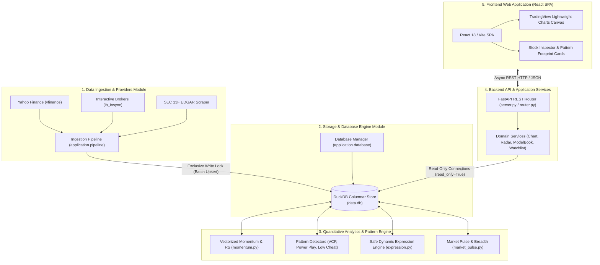

# PivotTrader Master System Architecture

[System Requirements](requirements.md) | [Agent Guidelines](../AGENTS.md)

---

## 1. System Vision & Architecture Principles

**PivotTrader** is designed as a decoupled, high-performance quantitative momentum screener, chart visualizer, and market regime intelligence platform. It processes multi-year historical daily bars across thousands of US equities in under a second.

The architecture is governed by four core design principles:
1. **In-Process Analytical Columnar Engine (OLAP)**: Embedded **DuckDB** eliminates external database server overhead, delivering sub-second vectorized execution across millions of rows via native SQL window functions.
2. **Strict Decoupling of Concerns**: Clear architectural boundaries between data ingestion, storage, quantitative indicator generation, REST services, and presentation.
3. **Deterministic Financial Accuracy**: Strict temporal boundary enforcement ensures zero lookahead bias in historical calculations and backtests.
4. **Agentic Engineering Harness**: Structured static and dynamic contexts, rigorous guardrails, and rapid targeted verification loops enable reliable autonomous software development.

---

## 2. High-Level System Architecture



---

## 3. Modular System Decomposition

PivotTrader is decomposed into five specialized subsystems. Each subsystem maintains its own dedicated design document detailing interfaces, class hierarchies, workflows, and edge-case handling:

| Subsystem Module | Primary Responsibility | Dedicated Design Document |
| :--- | :--- | :--- |
| **1. Data Ingestion & Providers** | Sourcing historical daily bars, fundamentals, and 13F filings across Yahoo Finance, Interactive Brokers, and SEC EDGAR. | [Data Providers Design Doc](modules/data_providers.md) |
| **2. Storage & Database Engine** | Embedded DuckDB columnar storage, DDL schemas, migrations, and single-writer / multi-reader concurrency isolation. | [Storage & Database Design Doc](modules/storage_database.md) |
| **3. Quantitative Analytics & Patterns** | Vectorized momentum, RS percentiles, Minervini VCP, Power Play, Low Cheat recognizers, and AST expression parsing. | [Analytics Engine Design Doc](modules/analytics_engine.md) |
| **4. Backend API & Services** | FastAPI REST routing, domain service abstraction, background subprocess execution, and TradingView clipboard formatting. | [Backend Services Design Doc](modules/backend_services.md) |
| **5. Frontend Web Application** | React 18 single-page application, TradingView Lightweight Charts canvas visualizer, footprint cards, and dark glassmorphic UI. | [Frontend SPA Design Doc](modules/frontend_spa.md) |

---

## 4. End-to-End Data Flow

The lifecycle of market data through PivotTrader progresses through distinct stages:

```mermaid
sequenceDiagram
    autonumber
    actor User as Solo Developer / User
    participant Pipe as Ingestion Pipeline
    participant Ext as Data Providers (YF/IBKR)
    participant DB as DuckDB (data.db)
    participant Engine as Analytics Engine
    participant API as FastAPI Backend
    participant UI as React Vite SPA

    User->>Pipe: Trigger Sync (CLI or UI button)
    Pipe->>Ext: Fetch EOD bars & fundamentals
    Ext-->>Pipe: Raw market payloads
    Pipe->>DB: Batch upsert bars (Write Lock)
    Pipe->>Engine: Run vectorized RS & pattern sweeps
    Engine->>DB: Update indicators & setup flags
    Note over DB,API: Single-Writer lock released; DB ready for read-only queries
    User->>UI: Adjust setup filters (e.g. Minervini Stage 2 + RS >= 80)
    UI->>API: POST /api/candidates (filter criteria)
    API->>DB: Execute sub-second SQL filter (read_only=True)
    DB-->>API: Filtered candidate set
    API-->>UI: Return JSON candidate list
    User->>UI: Click ticker for deep inspection
    UI->>API: GET /api/stocks/{symbol}/prices
    API->>DB: Retrieve OHLCV & moving averages
    DB-->>API: Historical bar array
    API-->>UI: Render canvas Candlestick chart + VCP Footprint
```

---

## 5. Cross-Cutting Architectural Concerns

### 5.1 Concurrency & File Lock Isolation
* **DuckDB Architectural Constraint**: DuckDB allows unlimited concurrent read connections but only **one** write connection.
* **Architecture Solution**:
  - All web service queries instantiated via [`DatabaseService`](../application/services/database.py) execute over connections opened strictly with `read_only=True`.
  - The CLI ingestion orchestrator [`application.pipeline`](../application/pipeline.py) opens write connections with exponential backoff retry logic, ensuring background updates never crash or lock out the UI.

### 5.2 Deterministic Financial Correctness & No Lookahead Bias
* **Temporal Slicing**: In all screening and pattern recognition routines, indicator calculations for day $T$ are strictly forbidden from referencing data from day $T+1$.
* **Window Specifications**: All rolling moving averages, highs, and volatility metrics use explicit bounded frames: `ROWS BETWEEN N PRECEDING AND CURRENT ROW`.

### 5.3 Agentic Engineering Harness & Token Economics
Applying the principles from [`Day_1_v3.pdf`](Day_1_v3.pdf):
* **Static Context**: Preserved in [`AGENTS.md`](../AGENTS.md) (~25 lines max) to prevent token bloat while strictly enforcing foundational boundaries.
* **Dynamic Context**: Loaded on-demand from modular documentation files (`modules/*.md`) and setup rules (`../data/setups.yaml`).
* **The Developer as Factory Manager**: The developer specifies intents, bounds, and requirements in documentation; AI coding agents implement within these guardrails.

### 5.4 Verification & Testing Discipline
* **Targeted Verification Only**:
  - **Frontend UI changes**: `npm run build` in `frontend/` (~200ms).
  - **Backend Python changes**: `./.venv/bin/python -m unittest tests/test_<feature>.py` (<1s).
  - Never execute the full 100+ test discovery suite during regular development cycles.

