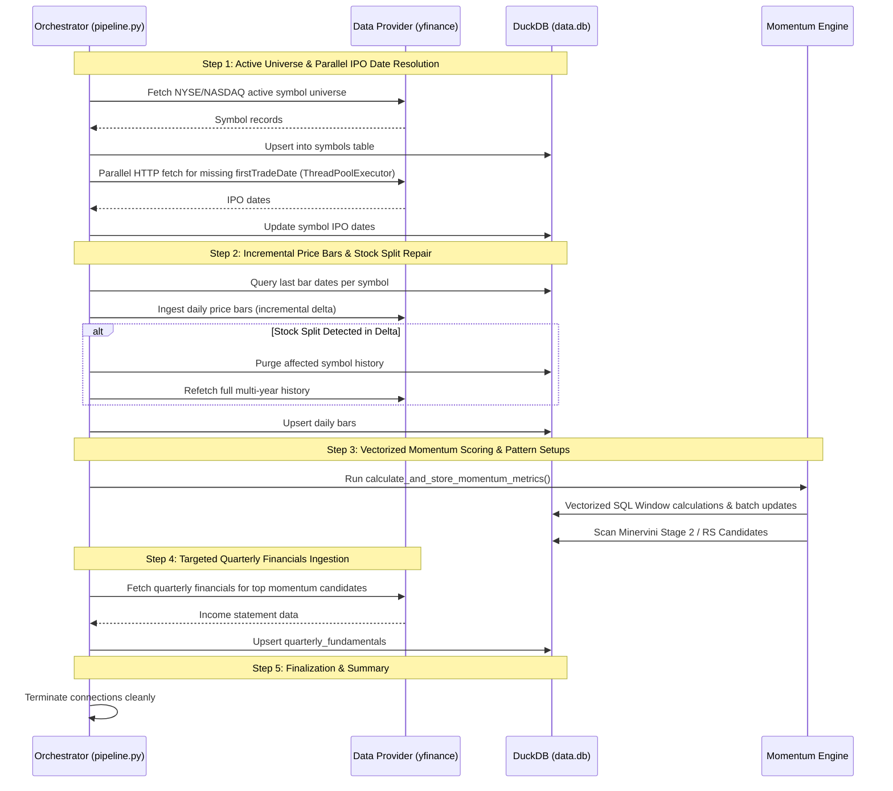

# Software Design Document
## PivotTrader: Momentum & Fundamental Screener

---

## 1. Introduction

This document details the software design for **PivotTrader**, a high-performance market screening engine. The design emphasizes modularity, code-level decoupling of data providers, and high-speed data processing leveraging an embedded DuckDB columnar engine.

---

## 2. Directory & Module Structure

The project follows a clean, modular Python and React project structure:

```text
PivotTrader/
├── docs/
│   ├── design.md             # Core architecture and engine design specification
│   ├── screen_setups.md      # Quantitative formulas and setup definitions
│   └── web_app_design.md     # Web UI, REST API, and data flow design
├── application/
│   ├── __init__.py
│   ├── config.py             # YAML configuration parser & validation schema
│   ├── database.py           # DuckDB schema manager, DDL migrations & upsert logic
│   ├── pipeline.py           # CLI data ingestion orchestrator (5-step pipeline)
│   ├── router.py             # FastAPI REST API endpoint router
│   ├── exporter.py           # TradingView formatting & system clipboard utility
│   ├── providers/
│   │   ├── __init__.py
│   │   ├── base.py           # Abstract Base Class for data providers
│   │   ├── yfinance_prov.py  # Yahoo Finance market data & fundamentals provider
│   │   └── ibkr_prov.py      # Interactive Brokers (ib_insync) provider
│   ├── engine/
│   │   ├── __init__.py
│   │   ├── momentum.py       # Vectorized SQL calculations & Relative Strength engine
│   │   ├── fundamental.py    # Fundamental QoQ earnings acceleration engine
│   │   └── setups/           # Chart pattern & momentum setup detectors
│   │       ├── __init__.py
│   │       ├── breakout.py   # Qullamaggie momentum consolidation & EMA surfing
│   │       ├── episodic_pivot.py # Earnings/catalyst volume gap-up detector
│   │       ├── parabolic_extension.py # Climax run-up & mean-reversion short/long
│   │       ├── power_play.py # High-tight flag 100%+ velocity run-up detector
│   │       └── vcp.py        # Mark Minervini Volatility Contraction Pattern recognizer
│   └── services/
│       ├── __init__.py
│       ├── config.py         # Config reader & YAML serializer service
│       ├── database.py       # Database query service, server-side filtering & stats
│       └── sync.py           # Background subprocess execution & live logs streaming
├── frontend/                 # React 18 + Vite SPA Web Application
│   ├── src/
│   │   ├── components/       # UI Tabs: Dashboard, Candidates, Inspector, Market Monitor, etc.
│   │   ├── App.jsx           # Master application container and navigation
│   │   └── index.css         # Glassmorphic dark-theme styles
│   └── dist/                 # Production static bundle served by FastAPI
├── config.yaml               # Runtime screener parameters configuration file
├── setups_and_rules.md       # Interactive trading playbook & execution checklists
├── server.py                 # FastAPI backend server with static SPA mounting
├── data.db                   # Local embedded DuckDB database file (Git ignored)
├── requirements.txt          # Python runtime dependencies
└── README.md                 # Project documentation & quickstart guide
```

---

## 3. Database Schema & DuckDB DDL

DuckDB uses a columnar layout optimized for OLAP. We enforce schema integrity and high-throughput ingestion through explicit DDL definitions, primary keys, and conflict upsert queries.

### 3.1 DDL Statements

```sql
-- 1. Symbols Directory Table
CREATE TABLE IF NOT EXISTS symbols (
    symbol VARCHAR PRIMARY KEY,
    exchange VARCHAR NOT NULL,
    name VARCHAR,
    asset_type VARCHAR NOT NULL,
    active BOOLEAN DEFAULT TRUE,
    ipo_date VARCHAR,
    sector VARCHAR,
    industry VARCHAR,
    next_earnings_date VARCHAR,
    last_updated TIMESTAMP DEFAULT CURRENT_TIMESTAMP
);

-- 2. Custom Watchlists Management Tables
CREATE SEQUENCE IF NOT EXISTS seq_watchlist_id START 1;

CREATE TABLE IF NOT EXISTS watchlists (
    id INTEGER PRIMARY KEY DEFAULT nextval('seq_watchlist_id'),
    name VARCHAR NOT NULL UNIQUE,
    created_at TIMESTAMP DEFAULT CURRENT_TIMESTAMP
);

CREATE TABLE IF NOT EXISTS watchlist_items (
    watchlist_id INTEGER NOT NULL,
    symbol VARCHAR NOT NULL,
    added_at TIMESTAMP DEFAULT CURRENT_TIMESTAMP,
    PRIMARY KEY (watchlist_id, symbol)
);

-- 3. Historical Daily Bars & Vectorized Technical Metrics Table
CREATE TABLE IF NOT EXISTS daily_bars (
    symbol VARCHAR NOT NULL,
    date DATE NOT NULL,
    open DOUBLE NOT NULL,
    high DOUBLE NOT NULL,
    low DOUBLE NOT NULL,
    close DOUBLE NOT NULL,
    volume BIGINT NOT NULL,
    vol_50d_ma DOUBLE,
    rs_score DOUBLE,
    rs_rank INTEGER,
    adr_20d DOUBLE,
    atr_20d DOUBLE,
    sma_50 DOUBLE,
    sma_150 DOUBLE,
    sma_200 DOUBLE,
    sma_200_20d_ago DOUBLE,
    ema_10 DOUBLE,
    ema_20 DOUBLE,
    dist_ema10_pct DOUBLE,
    dist_ema20_pct DOUBLE,
    high_52w DOUBLE,
    low_52w DOUBLE,
    dist_from_52w_high DOUBLE,
    dist_from_52w_low DOUBLE,
    surge_off_low_pct DOUBLE,
    is_52w_high BOOLEAN,
    ret_1m DOUBLE,
    ret_3m DOUBLE,
    ret_6m DOUBLE,
    gap_pct DOUBLE,
    rel_vol_50d DOUBLE,
    ti_65 DOUBLE,
    pivot_spread_pct DOUBLE,
    pivot_close_clustering_pct DOUBLE,
    pivot_vol_ratio DOUBLE,
    -- Power Play Setup Metrics
    pp_runup_pct DOUBLE,
    pp_drawdown_pct DOUBLE,
    pp_days_since_peak INTEGER,
    -- Volatility Contraction Pattern Metrics
    vcp_is_setup BOOLEAN,
    vcp_troughs INTEGER,
    vcp_depths VARCHAR,
    -- IPO Base Metrics
    ipo_days_count INTEGER,
    ipo_all_time_high DOUBLE,
    ipo_drawdown_from_high DOUBLE,
    ipo_base_depth DOUBLE,
    -- Episodic Pivot Metrics
    ep_is_setup BOOLEAN,
    ep_gap_pct DOUBLE,
    ep_rel_vol DOUBLE,
    -- Parabolic Extension Metrics
    parabolic_short_is_setup BOOLEAN,
    parabolic_long_is_setup BOOLEAN,
    parabolic_runup_pct DOUBLE,
    parabolic_drop_pct DOUBLE,
    parabolic_up_days INTEGER,
    PRIMARY KEY (symbol, date)
);

CREATE INDEX IF NOT EXISTS idx_daily_bars_date ON daily_bars(date);

-- 4. Historical Quarterly Fundamentals Table
CREATE TABLE IF NOT EXISTS quarterly_fundamentals (
    symbol VARCHAR NOT NULL,
    report_date DATE NOT NULL,
    fiscal_quarter VARCHAR NOT NULL, -- e.g., '2025-Q4'
    eps_diluted DOUBLE,
    eps_qoq_growth DOUBLE,
    total_revenue DOUBLE,
    PRIMARY KEY (symbol, fiscal_quarter)
);
```

---

## 4. Component Interfaces

### 4.1 Data Provider Abstract Interface
All data retrieval layers inherit from the `AbstractDataProvider` base class, allowing runtime switching between Yahoo Finance and Interactive Brokers (TWS / Gateway):

```python
# application/providers/base.py
from abc import ABC, abstractmethod
from typing import List, Dict, Any, Optional
import pandas as pd

class AbstractDataProvider(ABC):
    
    @abstractmethod
    def connect(self) -> None:
        """Establish session or connect to local gateway/sockets."""
        pass

    @abstractmethod
    def disconnect(self) -> None:
        """Cleanly close open socket sessions and connections."""
        pass

    @abstractmethod
    def fetch_universe(self) -> List[Dict[str, Any]]:
        """Retrieve symbol directories matching NYSE/NASDAQ parameters."""
        pass

    @abstractmethod
    def fetch_daily_bars(self, symbols: List[str], start_date: str) -> pd.DataFrame:
        """
        Fetch historical daily price bars starting from start_date.
        Returns DataFrame with symbol, date, open, high, low, close, volume, stock_splits.
        """
        pass

    @abstractmethod
    def fetch_premarket_bars(self, symbols: List[str]) -> pd.DataFrame:
        """Fetch pre-market quotes for the active trading day."""
        pass

    @abstractmethod
    def fetch_quarterly_fundamentals(self, symbols: List[str]) -> pd.DataFrame:
        """
        Fetch historical quarterly income statement details.
        Returns DataFrame with symbol, report_date, fiscal_quarter, eps_diluted, eps_qoq_growth, total_revenue.
        """
        pass
```

### 4.2 Modular Setup Screeners Package (`application/engine/setups`)
Pattern recognizers are implemented as standalone, pure algorithmic functions:

```python
# application/engine/setups/
def detect_vcp(highs, lows, dates, closes=None, window=3) -> dict: ...
def detect_episodic_pivot(opens, highs, lows, closes, volumes, dates) -> dict: ...
def detect_parabolic_extension(highs, lows, closes, dates, emas_10) -> dict: ...
def detect_power_play(highs, lows, closes, volumes, dates, vol_50d_mas) -> dict: ...
def detect_breakout(highs, lows, closes, dates, emas_10=None, emas_20=None) -> dict: ...
```

### 4.3 Service Layer (`application/services/`)
- **`config_service`**: Reads, parses, and persists changes to `config.yaml`.
- **`db_service`**: Handles server-side candidate filtering, Stockbee Market Monitor metrics, Sector ETF performance, stock inspection details, and watchlist operations.
- **`sync_service`**: Manages background asynchronous execution of `application.pipeline` with live log streaming.

---

## 5. Algorithmic Detail & Vectorized SQL Calculations

Computing rolling metrics over 10,000+ symbols and millions of price bars is fully vectorized inside DuckDB using SQL window functions, running in seconds.

### 5.1 Comprehensive Technical Metrics Pipeline

```sql
WITH price_lags_raw AS (
    SELECT 
        db.rowid as r_id,
        db.symbol,
        db.date,
        db.open,
        db.close,
        db.high,
        db.low,
        db.volume,
        LAG(db.close, 1) OVER (PARTITION BY db.symbol ORDER BY db.date) as prev_close
    FROM daily_bars db
),
price_lags_base AS (
    SELECT 
        r_id, symbol, date, open, close, high, low, volume, prev_close,
        -- Moving Averages
        AVG(close) OVER (PARTITION BY symbol ORDER BY date ROWS BETWEEN 6 PRECEDING AND CURRENT ROW) as sma_7,
        AVG(close) OVER (PARTITION BY symbol ORDER BY date ROWS BETWEEN 64 PRECEDING AND CURRENT ROW) as sma_65,
        AVG(close) OVER (PARTITION BY symbol ORDER BY date ROWS BETWEEN 49 PRECEDING AND CURRENT ROW) as sma_50,
        AVG(close) OVER (PARTITION BY symbol ORDER BY date ROWS BETWEEN 149 PRECEDING AND CURRENT ROW) as sma_150,
        AVG(close) OVER (PARTITION BY symbol ORDER BY date ROWS BETWEEN 199 PRECEDING AND CURRENT ROW) as sma_200,
        -- 52-Week Range
        MAX(high) OVER (PARTITION BY symbol ORDER BY date ROWS BETWEEN 251 PRECEDING AND CURRENT ROW) as high_52w,
        MIN(low) OVER (PARTITION BY symbol ORDER BY date ROWS BETWEEN 251 PRECEDING AND CURRENT ROW) as low_52w,
        -- Short-term Pivot Tightness Bounds (3-day)
        MAX(high) OVER (PARTITION BY symbol ORDER BY date ROWS BETWEEN 2 PRECEDING AND CURRENT ROW) as peak_high_3d,
        MIN(low) OVER (PARTITION BY symbol ORDER BY date ROWS BETWEEN 2 PRECEDING AND CURRENT ROW) as lowest_low_3d,
        MAX(close) OVER (PARTITION BY symbol ORDER BY date ROWS BETWEEN 2 PRECEDING AND CURRENT ROW) as peak_close_3d,
        MIN(close) OVER (PARTITION BY symbol ORDER BY date ROWS BETWEEN 2 PRECEDING AND CURRENT ROW) as lowest_close_3d,
        AVG(volume) OVER (PARTITION BY symbol ORDER BY date ROWS BETWEEN 49 PRECEDING AND CURRENT ROW) as vol_50d_ma,
        -- True Range
        GREATEST(
            high - low,
            COALESCE(ABS(high - prev_close), 0),
            COALESCE(ABS(low - prev_close), 0)
        ) as tr,
        -- Multi-Timeframe Historical Price Lags
        LAG(close, 21) OVER (PARTITION BY symbol ORDER BY date) as close_1m,
        LAG(close, 63) OVER (PARTITION BY symbol ORDER BY date) as close_3m,
        LAG(close, 126) OVER (PARTITION BY symbol ORDER BY date) as close_6m,
        LAG(close, 189) OVER (PARTITION BY symbol ORDER BY date) as close_9m,
        LAG(close, 252) OVER (PARTITION BY symbol ORDER BY date) as close_12m
    FROM price_lags_raw
),
price_lags_derived AS (
    SELECT
        r_id, symbol, date, close, vol_50d_ma,
        -- Volatility Measures (ADR% & ATR%)
        AVG((high / NULLIF(low, 0) - 1.0) * 100.0) OVER (PARTITION BY symbol ORDER BY date ROWS BETWEEN 19 PRECEDING AND CURRENT ROW) as adr_20d,
        AVG(tr) OVER (PARTITION BY symbol ORDER BY date ROWS BETWEEN 19 PRECEDING AND CURRENT ROW) / NULLIF(close, 0) * 100 as atr_20d,
        sma_50, sma_150, sma_200,
        LAG(sma_200, 20) OVER (PARTITION BY symbol ORDER BY date) as sma_200_20d_ago,
        -- Trend Intensity Ratio
        ROUND(sma_7 / NULLIF(sma_65, 0), 4) as ti_65,
        high_52w, low_52w,
        (high_52w - close) / NULLIF(high_52w, 0) * 100 as dist_from_52w_high,
        (close - low_52w) / NULLIF(low_52w, 0) * 100 as dist_from_52w_low,
        -- Pivot Tightness Metrics
        ROUND((peak_high_3d - lowest_low_3d) / NULLIF(close, 0) * 100.0, 2) as pivot_spread_pct,
        ROUND((peak_close_3d - lowest_close_3d) / NULLIF(close, 0) * 100.0, 2) as pivot_close_clustering_pct,
        ROUND(volume / NULLIF(vol_50d_ma, 0), 2) as pivot_vol_ratio,
        -- Multi-timeframe Returns %
        (close - COALESCE(close_1m, close)) / NULLIF(COALESCE(close_1m, close), 0) * 100.0 as ret_1m,
        (close - COALESCE(close_3m, close)) / NULLIF(COALESCE(close_3m, close), 0) * 100.0 as ret_3m,
        (close - COALESCE(close_6m, close)) / NULLIF(COALESCE(close_6m, close), 0) * 100.0 as ret_6m,
        (close - COALESCE(close_9m, close)) / NULLIF(COALESCE(close_9m, close), 0) * 100.0 as ret_9m,
        (close - COALESCE(close_12m, close)) / NULLIF(COALESCE(close_12m, close), 0) * 100.0 as ret_12m,
        ROUND((open - prev_close) / NULLIF(prev_close, 0) * 100.0, 2) as gap_pct,
        ROUND(volume / NULLIF(vol_50d_ma, 0), 2) as rel_vol_50d
    FROM price_lags_base
),
weighted_scores AS (
    SELECT
        *,
        (COALESCE(ret_3m, 0) * 0.4) + 
        (COALESCE(ret_6m, 0) * 0.2) + 
        (COALESCE(ret_9m, 0) * 0.2) + 
        (COALESCE(ret_12m, 0) * 0.2) as rs_score
    FROM price_lags_derived
),
percentile_ranks AS (
    SELECT
        *,
        CAST(PERCENT_RANK() OVER (PARTITION BY date ORDER BY rs_score) * 100 AS INTEGER) as rs_rank
    FROM weighted_scores
)
-- Persist results back to daily_bars
UPDATE daily_bars
SET 
    vol_50d_ma = src.vol_50d_ma,
    adr_20d = src.adr_20d,
    atr_20d = src.atr_20d,
    sma_50 = src.sma_50,
    sma_150 = src.sma_150,
    sma_200 = src.sma_200,
    sma_200_20d_ago = src.sma_200_20d_ago,
    ti_65 = src.ti_65,
    high_52w = src.high_52w,
    low_52w = src.low_52w,
    dist_from_52w_high = src.dist_from_52w_high,
    dist_from_52w_low = src.dist_from_52w_low,
    surge_off_low_pct = src.dist_from_52w_low,
    pivot_spread_pct = src.pivot_spread_pct,
    pivot_close_clustering_pct = src.pivot_close_clustering_pct,
    pivot_vol_ratio = src.pivot_vol_ratio,
    ret_1m = src.ret_1m,
    ret_3m = src.ret_3m,
    ret_6m = src.ret_6m,
    gap_pct = src.gap_pct,
    rel_vol_50d = src.rel_vol_50d,
    rs_score = src.rs_score,
    rs_rank = src.rs_rank
FROM percentile_ranks src
WHERE daily_bars.rowid = src.r_id;
```

---

## 6. Execution Flow & Ingestion Pipeline

The CLI orchestrator (`application/pipeline.py`) manages a 5-step automated synchronization sequence:



---

## 7. Export Pipeline and Clipboard Integration

To ensure seamless export to TradingView, Python's runtime environment uses platform-specific system clipboard commands:

```python
# application/exporter.py
import sys
import subprocess

class TradingViewExporter:
    @staticmethod
    def copy_to_clipboard(text: str) -> bool:
        """Copies the generated watchlist to the system clipboard across OS platforms."""
        try:
            if sys.platform == "darwin":  # macOS
                process = subprocess.Popen('pbcopy', stdin=subprocess.PIPE, text=True)
                process.communicate(text)
                return True
            elif sys.platform.startswith("linux"):
                process = subprocess.Popen(['xclip', '-selection', 'clipboard'], stdin=subprocess.PIPE, text=True)
                process.communicate(text)
                return True
            elif sys.platform == "win32":
                process = subprocess.Popen(['powershell', '-Command', 'Set-Clipboard'], stdin=subprocess.PIPE, text=True)
                process.communicate(text)
                return True
        except Exception:
            return False
        return False
```

---

## 8. Configuration Specification

Runtime parameters reside in `config.yaml` to decouple runtime criteria from application logic:

```yaml
# PivotTrader Configuration

# Active Database configuration
database:
  db_path: "data.db"

# Data Provider Configuration (Toggle between: "YFINANCE" or "IBKR")
provider:
  selected: "YFINANCE"
  price_provider: "YFINANCE"  # Use "YFINANCE" for fast daily bar downloads, or "IBKR"
  ibkr:
    host: "127.0.0.1"
    port: 7496  # Matches active TWS socket setting
    client_id: 1

# Universe Filtering Constraints (US Liquids)
universe_rules:
  min_price: 5.00
  min_volume_sma_50: 100000
  min_dollar_volume_50d: 5000000.0
  history_lookback_years: 5
  exchanges:
    - "NYSE"
    - "NASDAQ"

# Relative Strength (RS) Criteria
momentum_filters:
  min_rs_percentile: 70  # Minervini baseline (top 30% of relative strength score)

# Fundamental Acceleration Criteria
fundamental_filters:
  min_eps_growth_qoq: 20  # Minimum QoQ EPS growth percentage

# Qullamaggie 3 Setups Configuration
qullamaggie_setups:
  min_ep_gap_pct: 8.0
  min_ep_rel_vol: 2.5
  min_parabolic_runup_pct: 40.0
  min_parabolic_ema_ext_pct: 18.0
  min_parabolic_up_days: 3

# Watchlist Export Options
export:
  file_name: "Minervini_VCP_Candidates.txt"
  delimiter: ", "
```
