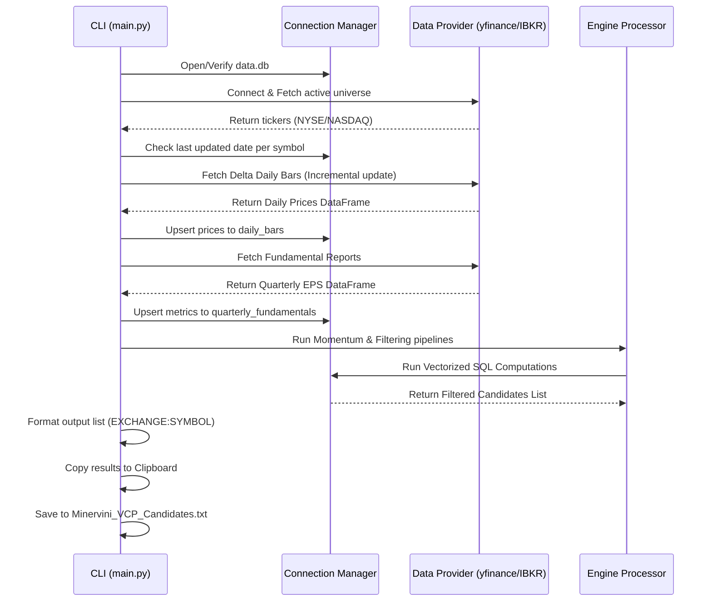

# Software Design Document
## PivotTrader: Momentum & Fundamental Screener

---

## 1. Introduction

This document details the software design for **PivotTrader**, a high-performance market screening engine. The design emphasizes modularity, code-level decoupling of data providers, and high-speed data processing leveraging an embedded DuckDB columnar engine.

---

## 2. Directory & Module Structure

The project will follow a clean, modular Python project structure:

```text
PivotTrader/
├── docs/
│   ├── requirements.md
│   └── design.md
├── config.yaml
├── data.db                   # Local DuckDB database file (Git ignored)
├── requirements.txt
├── main.py                   # CLI Execution Entrypoint
└── src/
    ├── __init__.py
    ├── config.py             # Config parser and validation schema
    ├── database.py           # DuckDB connection manager & DDL runner
    ├── providers/
    │   ├── __init__.py
    │   ├── base.py           # Abstract Base Class for data providers
    │   ├── yfinance_prov.py  # Yahoo Finance / Free API implementation
    │   └── ibkr_prov.py      # Interactive Brokers (ib_insync) implementation
    ├── engine/
    │   ├── __init__.py
    │   ├── momentum.py       # Relative Strength calculation engine
    │   └── fundamental.py    # QoQ EPS acceleration filtering engine
    └── exporter.py           # TradingView formatting & clipboard utility
```

---

## 3. Database Schema & DuckDB DDL

DuckDB uses a columnar layout optimized for OLAP. Although it supports standard SQL keys, primary key checks can incur overhead during bulk inserts. We will enforce schema integrity through DDL design and upsert queries.

### 3.1 DDL Statements

```sql
-- Symbol Directory Table
CREATE TABLE IF NOT EXISTS symbols (
    symbol VARCHAR PRIMARY KEY,
    exchange VARCHAR NOT NULL,
    name VARCHAR,
    asset_type VARCHAR NOT NULL,
    active BOOLEAN DEFAULT TRUE,
    last_updated TIMESTAMP DEFAULT CURRENT_TIMESTAMP
);

-- Historical Daily Bars Table
CREATE TABLE IF NOT EXISTS daily_bars (
    symbol VARCHAR NOT NULL,
    date DATE NOT NULL,
    open DOUBLE NOT NULL,
    high DOUBLE NOT NULL,
    low DOUBLE NOT NULL,
    close DOUBLE NOT NULL,
    volume BIGINT NOT NULL,
    vol_50d_ma DOUBLE,
    rs_score DOUBLE,
    rs_rank INTEGER,
    PRIMARY KEY (symbol, date)
);

-- Historical Quarterly Fundamentals Table
CREATE TABLE IF NOT EXISTS quarterly_fundamentals (
    symbol VARCHAR NOT NULL,
    report_date DATE NOT NULL,
    fiscal_quarter VARCHAR NOT NULL, -- e.g., '2025-Q4'
    eps_diluted DOUBLE,
    eps_qoq_growth DOUBLE,
    total_revenue DOUBLE,
    PRIMARY KEY (symbol, fiscal_quarter)
);
```

---

## 4. Component Interfaces

### 4.1 Data Provider Abstract Interface
All data retrieval layers must inherit from the `AbstractDataProvider` base class. This structure permits switching between yfinance and IBKR at runtime without altering the engine logic.

```python
# src/providers/base.py
from abc import ABC, abstractmethod
from typing import List, Dict, Any
import pandas as pd

class AbstractDataProvider(ABC):
    
    @abstractmethod
    def connect(self) -> None:
        """Establish session or connect to local gateway/sockets."""
        pass

    @abstractmethod
    def disconnect(self) -> None:
        """Cleanly close open socket sessions and connections."""
        pass

    @abstractmethod
    def fetch_universe(self) -> List[Dict[str, Any]]:
        """Retrieve symbol directories matching NYSE/NASDAQ parameters."""
        pass

    @abstractmethod
    def fetch_daily_bars(self, symbols: List[str], start_date: str) -> pd.DataFrame:
        """
        Fetch historical bars starting from start_date.
        Returns a DataFrame containing symbol, date, open, high, low, close, volume.
        """
        pass

    @abstractmethod
    def fetch_quarterly_fundamentals(self, symbols: List[str]) -> pd.DataFrame:
        """
        Fetch historical earnings per share and quarterly revenue.
        Returns a DataFrame containing symbol, report_date, fiscal_quarter, eps_diluted, total_revenue.
        """
        pass
```

### 4.2 Engine Pipeline Interfaces
The momentum and fundamental engines process data utilizing internal DuckDB SQL executions to perform operations directly inside the local DB file, minimizing memory consumption.

```python
# src/engine/momentum.py
import duckdb

class MomentumEngine:
    def __init__(self, db_path: str):
        self.db_path = db_path

    def compute_relative_strength(self) -> None:
        """
        Computes 50-day average volume, rolling 3m/6m/9m/12m price changes,
        calculates weighted RS momentum scores, and applies dense ranks.
        Writes scores and ranks back to daily_bars table.
        """
        pass
```

---

## 5. Algorithmic Detail & Vectorized SQL Calculations

Computing rolling metrics over thousands of stocks can easily bottleneck if looped in Python. PivotTrader will perform calculations using window functions directly within DuckDB SQL.

### 5.1 Vectorized Momentum Score & Rank
The following DuckDB SQL block shows the logical path for computing rolling performance and rankings:

```sql
WITH price_lags AS (
    -- Retrieve historical daily close prices for target dates
    SELECT 
        symbol,
        date,
        close,
        volume,
        -- Calculate rolling volume average
        AVG(volume) OVER (PARTITION BY symbol ORDER BY date ROWS BETWEEN 49 PRECEDING AND CURRENT ROW) as vol_50d_ma,
        -- Fetch historical close prices at distinct offsets
        LAG(close, 63) OVER (PARTITION BY symbol ORDER BY date) as close_3m,  -- ~63 trading days
        LAG(close, 126) OVER (PARTITION BY symbol ORDER BY date) as close_6m, -- ~126 trading days
        LAG(close, 189) OVER (PARTITION BY symbol ORDER BY date) as close_9m, -- ~189 trading days
        LAG(close, 252) OVER (PARTITION BY symbol ORDER BY date) as close_12m -- ~252 trading days
    FROM daily_bars
),
returns_calc AS (
    SELECT 
        symbol,
        date,
        close,
        vol_50d_ma,
        (close - close_3m) / NULLIF(close_3m, 0) as ret_3m,
        (close - close_6m) / NULLIF(close_6m, 0) as ret_6m,
        (close - close_9m) / NULLIF(close_9m, 0) as ret_9m,
        (close - close_12m) / NULLIF(close_12m, 0) as ret_12m
    FROM price_lags
    WHERE close >= 5.00 AND vol_50d_ma >= 300000
),
weighted_score AS (
    SELECT 
        symbol,
        date,
        vol_50d_ma,
        -- Mathematical Weighting
        (ret_3m * 0.4) + (ret_6m * 0.2) + (ret_9m * 0.2) + (ret_12m * 0.2) as raw_score
    FROM returns_calc
)
-- Compute Relative Strength Percentile Ranking
SELECT 
    symbol,
    date,
    raw_score,
    NTILE(100) OVER (PARTITION BY date ORDER BY raw_score) as rs_percentile
FROM weighted_score;
```

---

## 6. Execution Flow & Sequence

The orchestrator (`main.py`) controls step-by-step processing to minimize API usage:



---

## 7. Export Pipeline and Clipboard Integration

To ensure seamless export to TradingView, Python's runtime environment will use platform-specific system clipboard commands to write the watchlist string directly to memory.

```python
# src/exporter.py
import sys
import subprocess

class TradingViewExporter:
    @staticmethod
    def copy_to_clipboard(text: str) -> bool:
        """Copies the generated watchlist to the system clipboard across OS platforms."""
        try:
            if sys.platform == "darwin":  # macOS
                process = subprocess.Popen('pbcopy', stdin=subprocess.PIPE, text=True)
                process.communicate(text)
                return True
            elif sys.platform.startswith("linux"):
                process = subprocess.Popen(['xclip', '-selection', 'clipboard'], stdin=subprocess.PIPE, text=True)
                process.communicate(text)
                return True
            elif sys.platform == "win32":
                # Fallback via powershell command
                process = subprocess.Popen(['powershell', '-Command', 'Set-Clipboard'], stdin=subprocess.PIPE, text=True)
                process.communicate(text)
                return True
        except Exception:
            return False
        return False
```

---

## 8. Configuration Specification

The runtime parameters will reside inside a root-level `config.yaml` file to separate code from screening requirements:

```yaml
# PivotTrader Ingestion & Screener Configuration

# Active Database Configuration
database:
  db_path: "data.db"

# Data Provider Configuration (Toggle between: "YFINANCE" or "IBKR")
provider:
  selected: "YFINANCE"
  ibkr:
    host: "127.0.0.1"
    port: 7497  # Default paper trading port; use 7496 for live trading
    client_id: 1

# Universe & Scanning Criteria
universe_rules:
  min_price: 5.00
  min_volume_sma_50: 300000
  exchanges:
    - "NYSE"
    - "NASDAQ"

# Quantitative Filters
momentum_filters:
  min_rs_percentile: 70  # Minervini top 30% rule

fundamental_filters:
  min_eps_growth_qoq: 20  # Minimum QoQ EPS growth percentage

# Watchlist Export Preferences
export:
  file_name: "Minervini_VCP_Candidates.txt"
  delimiter: ", "
```
