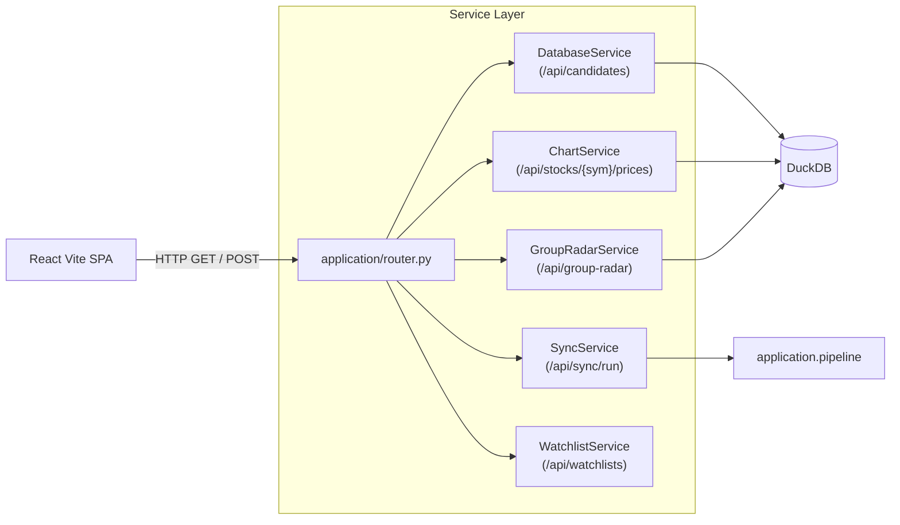

# Module Design: Backend API & Application Services

[<- Back to Master Architecture](../architecture.md) | [Requirements](../requirements.md)

---

## 1. Overview & Purpose

The **Backend API & Application Services Module** serves as the application boundary between persistent DuckDB storage, the quantitative analytics engine, and the frontend React application. Built with **FastAPI**, it provides a high-throughput, async REST API organized cleanly into domain-specific service classes.

---

## 2. Component Structure

```
├── server.py                 # FastAPI application root & static asset mount
├── application/
│   ├── router.py             # HTTP route declarations & request validation
│   ├── exporter.py           # TradingView symbol list formatter & clipboard utility
│   └── services/
│       ├── database.py       # Candidate filtering & DuckDB query execution
│       ├── chart_service.py  # Candlestick OHLCV formatting for lightweight-charts
│       ├── group_radar_service.py # Sector/Industry RRG calculations & rotation
│       ├── leaderboard_service.py # RS & volume momentum leaderboard ranking
│       ├── model_book_service.py  # Model Book trade examples archive
│       ├── saved_trades_service.py# Custom user trade journaling & PnL tracking
│       ├── theme_service.py  # Thematic basket monitoring (data/themes.yaml)
│       ├── setup_service.py  # Screener setup configuration parser
│       ├── cross_asset_service.py # Intermarket relationships (Yields, Oil, Gold)
│       ├── options_service.py# Unusual options activity & put/call ratios
│       ├── taxonomy.py       # Industry & sector grouping definitions
│       ├── sync.py           # Subprocess execution for background ingestion
│       └── config.py         # Runtime YAML configuration management
```

---

## 3. Core REST Endpoints



### Key API Categories:
1. **Screening & Candidates (`/api/candidates`)**:
   - Accepts active setup filters (Stage 2, VCP, Power Play, Low Cheat, Custom Expression), slider bounds, and historical target dates (`as_of_date`).
   - Executes parameterized read-only DuckDB queries in $< 100\text{ms}$.
2. **Chart Data (`/api/stocks/{symbol}/prices`)**:
   - Returns daily OHLCV bars formatted specifically for Lightweight Charts, including moving averages (SMA 50, 150, 200, EMA 10, 20) and volume metrics.
3. **Market Breadth & Radar (`/api/market-monitor`, `/api/group-radar`)**:
   - Delivers Stockbee Market Monitor breadth numbers and Sector/Industry RRG coordinates.
4. **Data Sync Orchestrator (`/api/sync/run`, `/api/sync/status`)**:
   - Dispatches `application.pipeline` as an asynchronous background subprocess. Streams stdout/stderr logs live to the frontend.

---

## 4. Subprocess Execution & Thread Safety

* The web server must remain non-blocking during lengthy ingestion tasks.
* [`SyncService`](../../application/services/sync.py) spawns the background pipeline using `subprocess.Popen` and captures terminal output in a thread-safe ring buffer for frontend streaming.
* FastAPI endpoints connect exclusively with `read_only=True`, completely decoupling query threads from pipeline write processes.

---

## 5. Related Modules & Documentation

* [Storage & Database Engine Module](storage_database.md) - DuckDB query interface consumed by services.
* [Frontend Web Application Module](frontend_spa.md) - React UI consuming these REST endpoints.
* [Master Architecture](../architecture.md) - Overall system topology and data flow.

