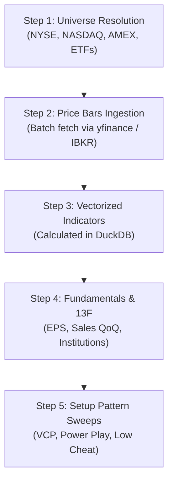

# Module Design: Data Ingestion & Providers

[<- Back to Master Architecture](../architecture.md) | [Requirements](../requirements.md)

---

## 1. Overview & Purpose

The **Data Ingestion & Providers Module** is responsible for sourcing historical price bars, intraday quotes, fundamental quarterly earnings/revenue statements, and institutional 13F ownership data from external financial data providers. It normalizes external payloads into standardized tabular representations, handles corporate actions / split adjustments, and schedules bulk upserts into DuckDB.

---

## 2. Component Structure

```
application/
├── providers/
│   ├── base.py           # Abstract Base Class (AbstractDataProvider)
│   ├── yfinance_prov.py  # Yahoo Finance API adapter (EOD bars, fundamentals)
│   ├── ibkr_prov.py      # Interactive Brokers API adapter (ib_insync)
│   └── sec_13f_prov.py   # SEC EDGAR 13F institutional holdings scraper
└── pipeline.py           # 5-step ingestion pipeline orchestrator
```

### Key Classes & Interfaces
* [`AbstractDataProvider`](../../application/providers/base.py): Base class defining abstract methods:
  - `connect()`
  - `fetch_historical_bars(symbols, start_date, end_date)`
  - `fetch_fundamentals(symbols)`
  - `fetch_institutional_holdings(symbols)`
* [`YFinanceProvider`](../../application/providers/yfinance_prov.py): Production implementation leveraging `yfinance` with rate limiting, multi-threading, and retry logic.
* [`IBKRProvider`](../../application/providers/ibkr_prov.py): Real-time and historical bar provider integrating with TWS/IB Gateway via `ib_insync`.
* [`SEC13FProvider`](../../application/providers/sec_13f_prov.py): Scrapes and calculates institutional sponsorship and top fund ownership changes.
* [`PipelineOrchestrator`](../../application/pipeline.py): CLI ingestion driver executing sequential stages.

---

## 3. Ingestion Pipeline Workflow



### Stage Details:
1. **Universe Resolution**: Discovers active symbols and filters out illiquid penny stocks, warrants, and expired instruments. Delisted symbols are flagged in the database ([`tests/test_delisting.py`](../../tests/test_delisting.py)).
2. **Daily Price Bar Ingestion**: Incremental delta fetch. Only queries dates $> \max(\text{date})$ existing in `daily_bars` for each symbol.
3. **Split Adjustments & Corporate Actions**: Ensures price and volume history remain consistent without retroactive corruption ([`tests/test_split_adjustment.py`](../../tests/test_split_adjustment.py)).
4. **Fundamentals Ingestion**: Scrapes quarterly EPS, diluted net income, and total revenues to track quarterly acceleration.
5. **Setup Detection Trigger**: Flags candidate patterns for the active trading date.

---

## 4. Concurrency & Locking Strategy

* The ingestion pipeline opens an exclusive **read-write** DuckDB connection to `data.db`.
* To prevent `Database Locked` exceptions when the FastAPI server is running, the pipeline utilizes [`DatabaseManager.get_connection()`](../../application/database.py) with exponential backoff retries.
* The web server accesses the database strictly with `read_only=True` to prevent lock starvation.

---

## 5. Related Modules & Documentation

* [Storage & Database Engine Module](storage_database.md) - Details DDL tables (`daily_bars`, `quarterly_fundamentals`, `symbols`).
* [Quantitative Analytics Engine Module](analytics_engine.md) - Calculates momentum and setup flags from ingested bars.
* [System Requirements](../requirements.md) - Outlines data accuracy and split-adjustment specifications.

