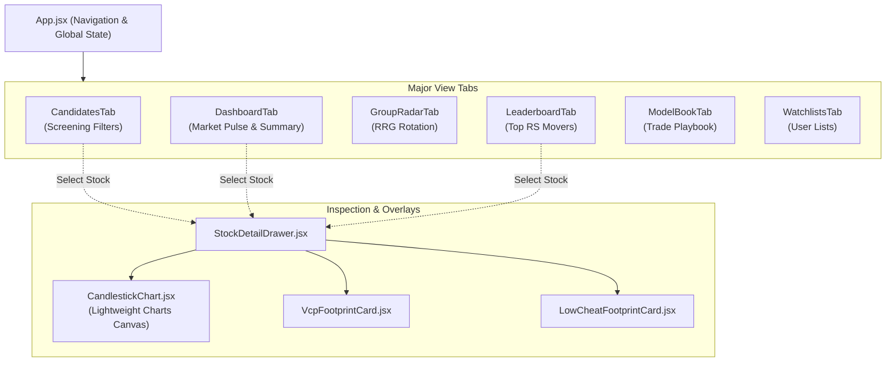

# Module Design: Frontend Web Application (React SPA)

[<- Back to Master Architecture](../architecture.md) | [Requirements](../requirements.md)

---

## 1. Overview & Purpose

The **Frontend Web Application Module** is an interactive, real-time single-page application (SPA) built with **React 18** and **Vite**. It provides active stock screening, dynamic setup filtering, institutional-grade financial chart inspection with **TradingView Lightweight Charts**, sector rotation graphs, and trade journal management.

---

## 2. Component Structure

```
frontend/
├── index.html
├── vite.config.js            # Build configuration with proxy to FastAPI (port 8000)
└── src/
    ├── App.jsx               # Master application container, navigation tabs, and state
    ├── index.css             # Glassmorphic dark theme CSS system
    └── components/
        ├── CandidatesTab.jsx        # Active screener board with slider controls & setup filters
        ├── CandlestickChart.jsx     # High-performance canvas chart (TradingView Lightweight Charts)
        ├── StockDetailDrawer.jsx    # Slide-out stock inspector (financials, footprints, notes)
        ├── DashboardTab.jsx         # Market overview, pulse cards, and daily summary
        ├── MarketPulseCard.jsx      # Stockbee Market Monitor breadth metrics
        ├── GroupRadarTab.jsx        # Sector & Industry Relative Rotation Graph (RRG)
        ├── RRGQuadrantChart.jsx     # Canvas-based 4-quadrant RRG visualizer
        ├── LeaderboardTab.jsx       # Multi-timeframe RS score leaders
        ├── ModelBookTab.jsx         # Exemplary historical trade archive visualizer
        ├── WatchlistsTab.jsx        # Custom watchlist manager and ticker organizer
        ├── SetupsAndRulesTab.jsx    # Live Markdown playbook editor & checklist
        ├── VcpFootprintCard.jsx     # Visual contraction depth ($D_1 > D_2 > D_3$) diagram
        ├── LowCheatFootprintCard.jsx# Visual shakeout & recovery base visualizer
        ├── ExpressionCheatSheet.jsx # Modal documentation for dynamic expression syntax
        ├── SqlConsoleTab.jsx        # In-browser direct DuckDB SQL query execution
        └── SyncDataTab.jsx          # Live pipeline runner with streaming subprocess logs
```

---

## 3. UI Component Architecture



---

## 4. Key Visual Components

### 4.1 Lightweight Charts Integration ([`CandlestickChart.jsx`](../../frontend/src/components/CandlestickChart.jsx))
* Built on TradingView's canvas-accelerated `lightweight-charts` library.
* Visual overlays:
  - Daily Candlestick series (Green/Red bars).
  - Trend moving averages: **SMA 50** (Blue `#3b82f6`), **SMA 150** (Orange `#f97316`), **SMA 200** (Pink `#ec4899`).
  - Short-term moving averages: **EMA 10** (Cyan `#06b6d4`), **EMA 20** (Yellow `#eab308`).
  - Historical volume histogram with 50-day volume moving average.
  - Interactive crosshairs displaying price, volume, and date coordinates.

### 4.2 Pattern Footprint Visualizers
* **VCP Footprint Card**: Displays progressive contraction stages ($D_1, D_2, D_3$) with contraction percentages, trough counts, and tight pivot indicators.
* **Low Cheat Footprint Card**: Visually diagrams base undercut levels, shakeout depth, and moving average recovery points.

---

## 5. Development & Build Verification Discipline

> [!IMPORTANT]
> **Agent Guideline for Frontend Changes**:
> * Whenever making edits within `frontend/`, verify strictly using:
>   ```bash
>   cd frontend && npm run build
>   ```
> * The build completes in $\sim 200\text{ms}$. Do **NOT** run Python backend tests for UI changes.

---

## 6. Related Modules & Documentation

* [Backend Services Module](backend_services.md) - REST API powering all UI components.
* [System Requirements](../requirements.md) - Functional UI requirements and UX specifications.
* [Master Architecture](../architecture.md) - System-wide architectural overview.

