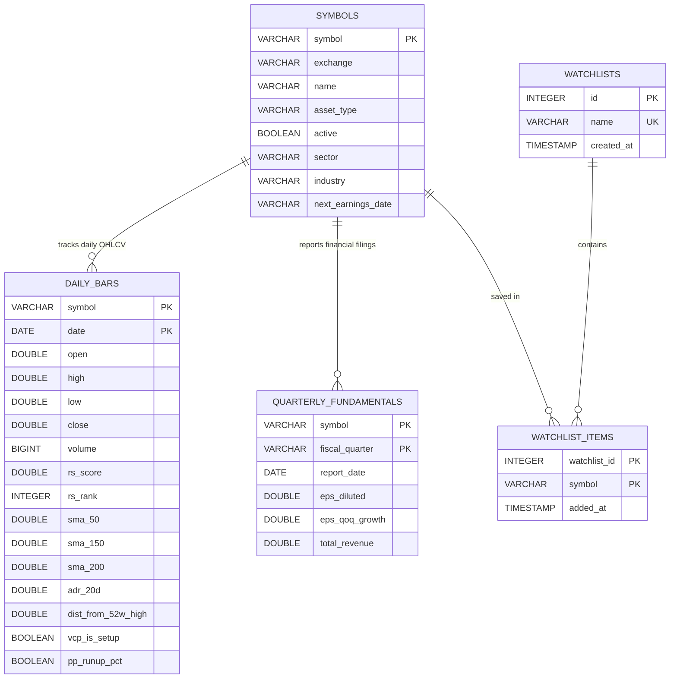

# Module Design: Storage & Database Engine

[<- Back to Master Architecture](../architecture.md) | [Requirements](../requirements.md)

---

## 1. Overview & Purpose

The **Storage & Database Engine Module** provides the analytical backbone for PivotTrader. By leveraging **DuckDB**—an embedded, columnar analytical database (OLAP)—PivotTrader achieves sub-second filtering across millions of price bars without the operational complexity or latency of external client-server databases like PostgreSQL.

---

## 2. Component Structure

```
application/
├── database.py           # Core DDL schema, migrations, connection management, upsert queries
└── services/
    └── database.py       # Database query service, server-side filtering, statistical aggregations
```

### Key Classes & Methods
* [`DatabaseManager`](../../application/database.py): Manages database lifecycle, migrations, and safe connection acquisition.
  - `init_db()`: Executes DDL schemas and sequence creations.
  - `get_connection(read_only=True)`: Context manager yielding thread-safe DuckDB connection.
  - `upsert_daily_bars(df)`: High-speed batch upserts utilizing DuckDB temp tables.
* [`DatabaseService`](../../application/services/database.py): Business query interface consumed by the FastAPI router.
  - `get_candidates(filter_params)`: Dynamic multi-parameter candidate filtering.
  - `get_symbol_history(symbol)`: Retrieves chronological price and moving average history.
  - `get_financials(symbol)`: Retrieves quarterly statement metrics.

---

## 3. Schema Architecture & DDL



---

## 4. Concurrency & Lock Management

DuckDB enforces a **single-writer, multiple-reader** file lock policy on the database file (`data.db`):

```
┌────────────────────────────────────────────────────────┐
│                   DuckDB Lock Policy                   │
├──────────────────────────┬─────────────────────────────┤
│ Web Application (FastAPI)│ Ingestion Pipeline (Worker) │
│ - Infinite Readers       │ - Single Exclusive Writer   │
│ - read_only=True         │ - Acquires Write Lock       │
│ - Never Blocks Readers   │ - Exponential Backoff Retry │
└──────────────────────────┴─────────────────────────────┘
```

1. **FastAPI Web Service**:
   All HTTP endpoints MUST instantiate connections with `read_only=True`:
   ```python
   con = duckdb.connect(db_path, read_only=True)
   ```
   This ensures that end users screening stocks or viewing charts never hold write locks or block other web queries.

2. **Ingestion & Writing Operations**:
   The ingestion orchestrator ([`pipeline.py`](../../application/pipeline.py)) requires write access. When acquiring a write connection, it wraps the connection in an exponential retry loop to gracefully wait if another process momentarily holds a lock ([`tests/test_concurrency.py`](../../tests/test_concurrency.py)).

---

## 5. Performance Optimization Techniques

* **Columnar Execution**: Filters on `daily_bars` (such as `rs_rank >= 80 AND close > sma_50`) only scan the relevant numeric columns, executing in tens of milliseconds.
* **Indexed Temporal Lookups**: Explicit indices on `daily_bars(date)` accelerate date-slicing queries for Market Monitor and Universe scans.
* **Conflict-Free Bulk Upsert**: Ingestion uses DuckDB `ON CONFLICT (symbol, date) DO UPDATE` syntax, avoiding duplicate key errors and enabling safe incremental daily delta syncs.

---

## 6. Related Modules & Documentation

* [Data Providers Module](data_providers.md) - Pipeline writer populating `daily_bars`.
* [Quantitative Analytics Engine Module](analytics_engine.md) - SQL queries computing indicators on database tables.
* [Backend Services Module](backend_services.md) - Service layer wrapping DuckDB queries for REST endpoints.

