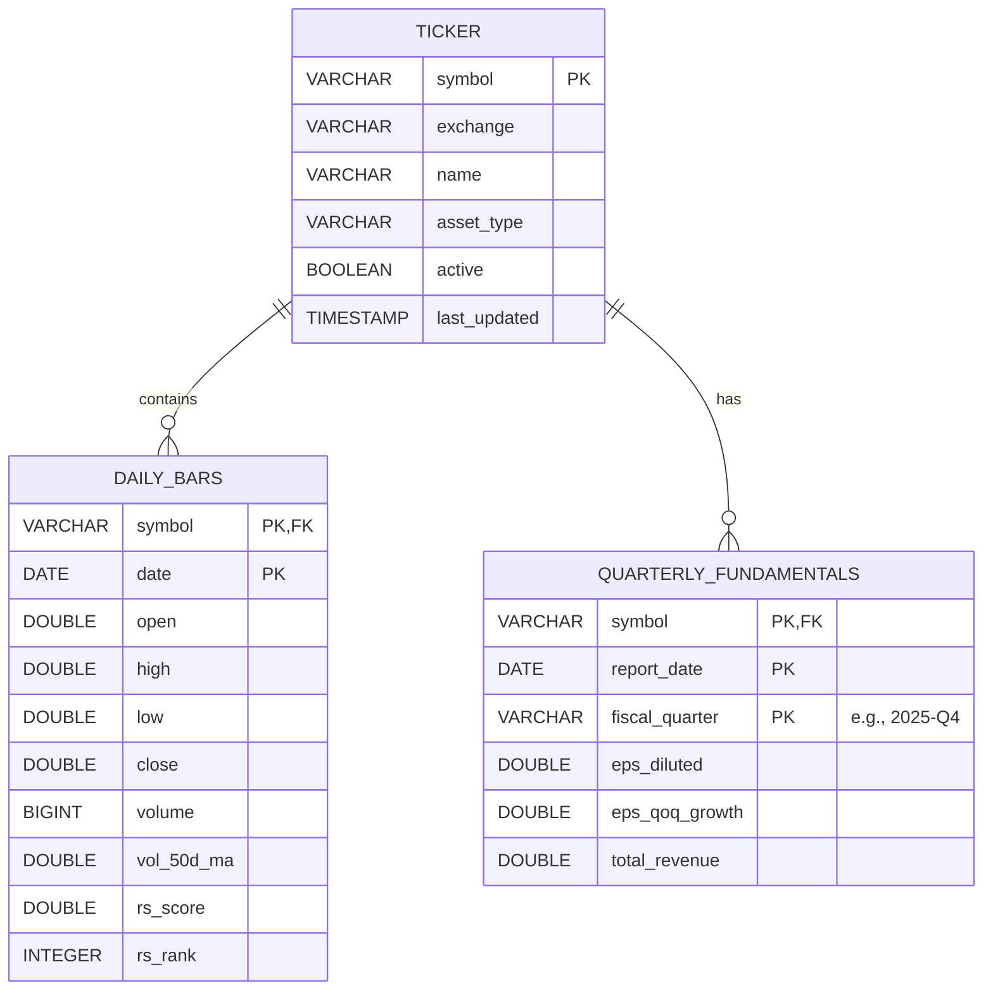
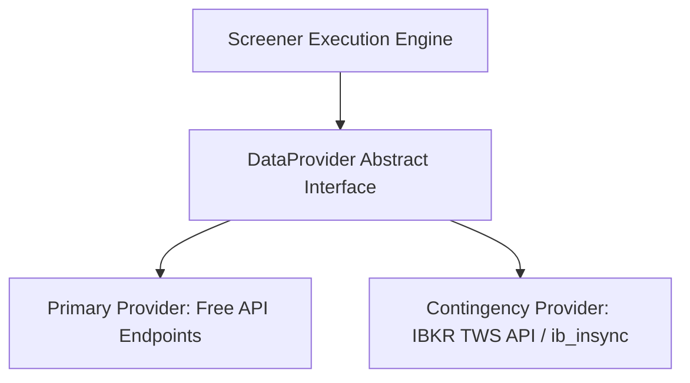
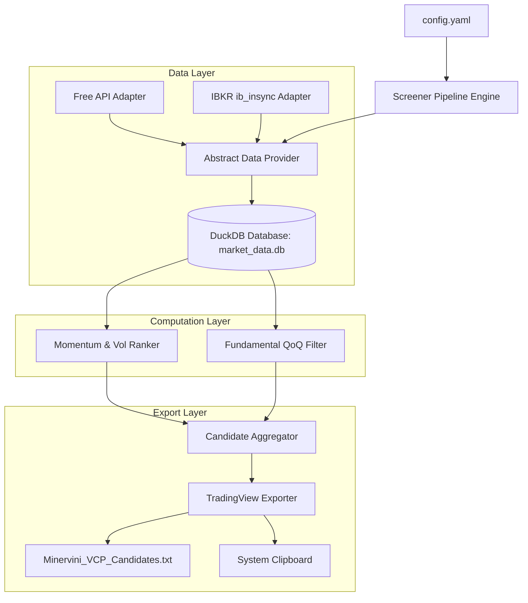

# Software Requirements Specification (SRS)
## PivotTrader: High-Performance Momentum & Fundamental Screener

---

## 1. Document Overview & Purpose

This document outlines the formal business requirements, algorithmic specifications, data architectures, and system designs for **PivotTrader**, a data ingestion and filtering engine. PivotTrader is designed to identify high-potential US liquid growth stocks using Relative Strength (RS) momentum ranking (based on Mark Minervini's Trend Template criteria) combined with configurable fundamental growth constraints (O'Neil/TraderLion style QoQ EPS acceleration).

---

## 2. Universe Boundaries (US Liquids)

To protect the execution environment from extreme slippage, low liquidity, and corporate restructuring anomalies, the ingestion engine must apply strict filters before executing downstream mathematical calculations.

### 2.1 Exchange & Instrument Filtering
* **Eligible Exchanges:** Only issues actively trading on the **NYSE** (New York Stock Exchange) and **NASDAQ** are allowed.
* **Prohibited Instruments:** The system must actively filter out and exclude:
  * American Depositary Receipts (ADRs)
  * Penny stocks (shares trading under $5.00)
  * Exchange-Traded Funds (ETFs) and Exchange-Traded Notes (ETNs)
  * Preferred shares
  * Blank-check companies (SPACs)

### 2.2 Liquidity Filter Constraints
A ticker must satisfy both parameters dynamically on a rolling daily basis:
* **Minimum Price:** Current close price $P_t \ge \$5.00$.
* **Rolling Liquidity:** 50-day simple moving average of volume ($SMA_{50}(Volume) \ge 300,000$ shares).

---

## 3. Relative Strength Math & Ranking

The Relative Strength momentum engine is the scoring core of PivotTrader. It computes a weighted price change score for every stock in the active universe slice and determines its percentile ranking.

### 3.1 Momentum Score Formula
For every stock $i$ in the filtered universe, a daily rolling momentum score is computed using historical close prices:

$$\text{Score}_i = (\Delta P_{3\text{M}} \times 0.4) + (\Delta P_{6\text{M}} \times 0.2) + (\Delta P_{9\text{M}} \times 0.2) + (\Delta P_{12\text{M}} \times 0.2)$$

Where the price change interval $\Delta P_{K}$ represents the rate of return over the prior $K$ months:

$$\Delta P_{K} = \frac{P_{\text{current}} - P_{K\text{ Months Ago}}}{P_{K\text{ Months Ago}}}$$

### 3.2 Universe Percentile Ranking
* **Relative Percentile Rank:** On each trading day $t$, the system ranks all momentum scores across the *entire filtered universe slice* from 1 to 99.
* **Minervini Momentum Threshold:** A stock satisfies the Relative Strength momentum filter if its percentile rank is $\ge 70$ (top 30% of the active liquid universe).

---

## 4. Fundamental Filtering (QoQ EPS Growth Acceleration)

To confirm institutional interest, the screener cross-references price momentum with fundamental earnings growth.

### 4.1 Configurable Parameters
* **Parameter Name:** `MIN_EPS_GROWTH_QOQ` (default value: `20`, representing a minimum $20\%$ growth rate).
* **Location:** Stored in a local configuration file (e.g., `config.yaml` or `config.json`).

### 4.2 Growth Acceleration Metric
* **QoQ Comparison:** The engine compares the Diluted Earnings Per Share (EPS) of the most recent fiscal quarter ($Q_0$) to the same fiscal quarter from the prior year ($Q_{-4}$).
* **Math Specification:**
  
$$\text{EPS Growth QoQ} = \frac{\text{EPS}_{Q_0} - \text{EPS}_{Q_{-4}}}{\max(0.01, |\text{EPS}_{Q_{-4}}|)} \times 100$$

* Tickers must have $\text{EPS Growth QoQ} \ge \text{MIN\_EPS\_GROWTH\_QOQ}$ to pass the fundamental screening phase.

---

## 5. Storage Architecture (Embedded DuckDB)

The system stores all market, historical, and fundamental data locally in a single embedded database file named `market_data.db` utilizing **DuckDB**.

### 5.1 Why DuckDB?
* **Columnar Operations:** Provides fast vectorized scans and aggregations for computing moving averages and rolling rank percentiles over millions of rows of daily bar data.
* **Zero Overhead:** Operates inside the Python process without requiring an external server or service installation.

### 5.2 Conceptual Schema Design



---

## 6. Data Sourcing Strategy

The system adopts a dual-tier data access pattern managed via an abstract data provider layer.



### 6.1 Primary Tier (Free Endpoints)
* Used for general daily bars and basic symbol information.
* subject to standard rate limiting and API coverage variations.

### 6.2 Contingency Tier (Interactive Brokers / `ib_insync`)
* **Trigger:** Activated via configuration switch (`DATA_PROVIDER = "IBKR"`) if the primary API suffers from missing fundamental metrics, split adjustments, or rate limits.
* **Execution:** Connects to a locally running Trader Workstation (TWS) or IB Gateway instance via the `ib_insync` library to retrieve clean daily historical bars and institutional-grade financial statements.

---

## 7. Export Pipeline & TradingView Compatibility

Because TradingView lacks a write-capable public API for updating user watchlists, PivotTrader exports candidates to a standard text output file optimized for rapid manual import.

### 7.1 Text Format Specification
* **Structure:** Comma-separated or newline-separated values.
* **Identifier Prefix:** Tickers must be prefixed by their official exchange identifier (e.g. `EXCHANGE:SYMBOL`).
* **Example Output:**
  ```text
  NYSE:VRT, NASDAQ:CELH, NASDAQ:IOT, NYSE:NET
  ```

### 7.2 Automation Workflow
1. The export script dynamically generates a watch list file named according to the configuration (e.g., `Minervini_VCP_Candidates.txt`).
2. The script copies the raw, formatted string directly to the system clipboard using the python `pyperclip` library (or similar native OS binding).
3. The user receives a console/terminal confirmation and can paste the clipboard contents directly into TradingView's "Import Watchlist" field.

---

## 8. System Architecture Overview



---

## 9. Non-Functional Requirements

### 9.1 Efficiency & Performance
* **Vectorized Processing:** Momentum score calculations, 50-day average volumes, and universe-wide percentile rankings must be written using vectorized SQL/DuckDB logic to complete calculations under **2 seconds** for a 5,000-ticker, 1-year historical dataset.
* **Incremental Updates:** The data ingestion pipeline must fetch only new daily bars since the last run instead of performing full-universe historical downloads on every execution.

### 9.2 Error Handling & Resilience
* **API Rate Limiting:** The pipeline must respect rate limits of both Free and IBKR providers using exponential backoff and sleep loops.
* **Corrupt Data Handling:** Any records containing negative values for volume or price must be flagged and skipped during calculations.
