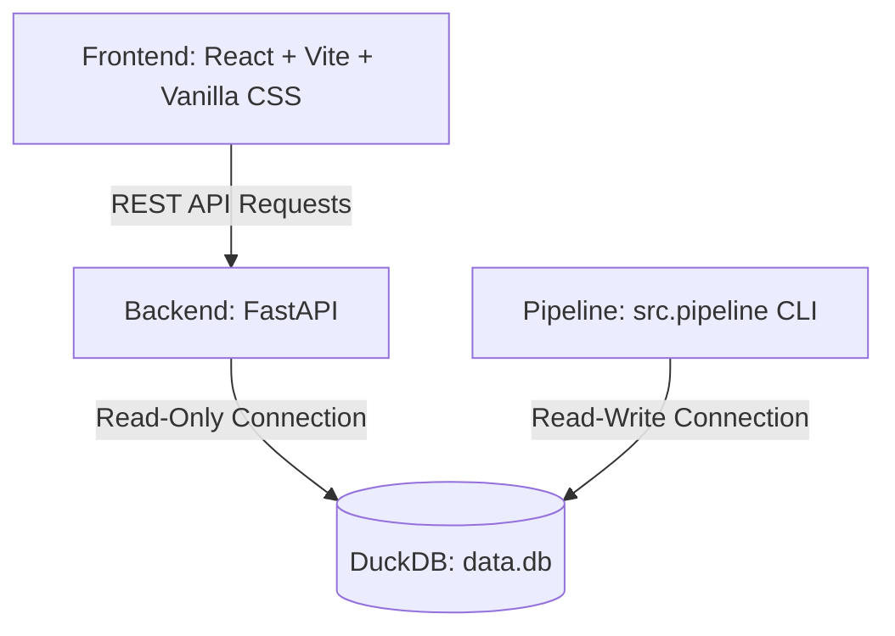
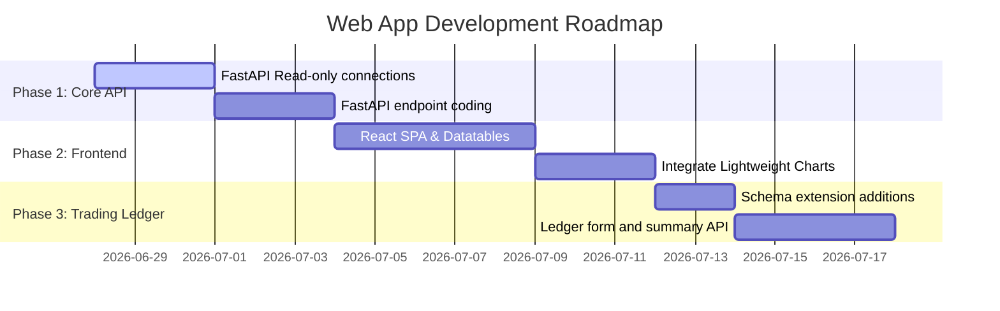

# Web Application Design Document
## PivotTrader Dashboard & Portfolio Manager

---

## 1. Executive Summary & Goals

The PivotTrader Web Application will serve as an interactive user interface to view and manage the underlying DuckDB database, configure screening parameters, inspect daily candlestick charts, track quarterly earnings acceleration, and maintain a trading ledger (portfolio logs).

---

## 2. System Architecture

To ensure separation of concerns and portability, the application uses a decoupled client-server architecture:



### 2.1 DuckDB Concurrency Strategy (Crucial Design Point)
DuckDB enforces a single-writer, multiple-reader locking mechanism:
* **The Problem:** If the backend web server opens `data.db` in read-write mode, the background scheduler/script `src/pipeline.py` will fail with a `Database Locked` error.
* **The Solution:** The FastAPI backend will establish connection objects using the `read_only=True` parameter:
  ```python
  import duckdb
  conn = duckdb.connect("data.db", read_only=True)
  ```
  This allows the web API to serve concurrent client requests while the background screening pipeline successfully writes updates.

---

## 3. Backend API Design (FastAPI)

The backend will expose a clean REST API written in Python using **FastAPI** and **Uvicorn**.

### 3.1 REST API Endpoint Definition

| HTTP Method | Route | Description |
| :--- | :--- | :--- |
| **`GET`** | `/api/summary` | Retrieve summary counts (symbols, daily bars count, last updated timestamps). |
| **`GET`** | `/api/candidates` | Retrieve the latest screened stocks passing active RS and EPS criteria. |
| **`GET`** | `/api/stocks/{symbol}` | Retrieve metadata and quarterly fundamentals for a specific symbol. |
| **`GET`** | `/api/stocks/{symbol}/prices` | Retrieve historical daily bars (for charting). |
| **`GET`** | `/api/config` | Retrieve current runtime config criteria. |
| **`POST`** | `/api/config` | Update parameters inside `config.yaml`. |
| **`POST`** | `/api/sync/run` | Trigger a new background data fetch and calculation scan. |
| **`GET`** | `/api/sync/status` | Retrieve background screening run logs and status. |
| **`POST`** | `/api/sql/query` | Execute raw SQL statements directly on the read-only database. |

---

## 4. Frontend Interface Design

The frontend will be built as a modern Single Page Application (SPA) using **React (Vite)** styled with **Vanilla CSS** following custom design rules:
* **Typography:** Modern clean fonts (e.g. Google Fonts *Outfit* or *Inter*).
* **Color Palette:** harmonious dark-mode glassmorphism (slate background `#0B0F19`, translucent cards `#171D2C/90`, neon accents: green `#10B981` for upward momentum, blue `#3B82F6` for operations).

### 4.1 Interface Layout & Views

```
+-------------------------------------------------------------------------+
|  PivotTrader Dashboard      [Sync Database] [SQL Console] [Settings]   |
+-------------------------------------------------------------------------+
|  [Total Stocks]    [Top candidates]    [Last Updated]                   |
|  4,780             12 Candidates       2026-06-27 21:00                 |
+-------------------------------------------------------------------------+
|  Candidates Datatable                                                   |
|  Ticker  | RS Rank | Price  | Vol 50d MA | EPS QoQ Growth               |
|  ACA     | 98      | $85.20 | 450,000    | +60.4%                       |
|  ABX     | 95      | $12.40 | 800,000    | +40.0%                       |
|  ...     | ...     | ...    | ...        | ...                          |
+-------------------------------------------------------------------------+
```

1. **Dashboard View:** Shows metadata metrics, last update indicators, and direct triggers to run the data collection sequence in the background.
2. **Candidates Datatable:** A sortable data table showing relative strength values, price points, and QoQ growth acceleration rates with colored status pills.
3. **Detail Interactive Panel:** Opening a candidate displays:
   * A financial table showing historical quarterly metrics.
   * A clean interactive price chart (e.g., using TradingView's lightweight-charts or Recharts).
4. **SQL Console View:** An interactive interface allowing users to run custom analytics queries directly on the database:
   * **Input:** Multi-line SQL text area with syntax highlighting options.
   * **Output:** Dynamic, paginated table representing column headers and cell values returned from the database engine.
   * **Error Logs:** Clean syntax-error alerts displaying exact execution exceptions from the database.
   * **Implicit Security Validation:** Because the backend connection object is strictly instantiated with `read_only=True`, destructive queries (such as `DROP TABLE`, `DELETE`, `UPDATE`, or `INSERT`) are natively rejected by the DuckDB engine, preventing schemas and caches from accidental corruption or deletions.

---

## 5. Future Trading Record Ledger

To support the future portfolio tracking phase, we will expand the database schema and API.

### 5.1 Trading Database Schema Extensions

We will introduce a new table `trading_records` inside `data.db` to handle transactions:

```sql
CREATE TABLE IF NOT EXISTS trading_records (
    trade_id VARCHAR PRIMARY KEY,
    symbol VARCHAR NOT NULL,
    direction VARCHAR CHECK (direction IN ('BUY', 'SELL')),
    date DATE NOT NULL,
    shares INTEGER NOT NULL,
    price DOUBLE NOT NULL,
    commission DOUBLE DEFAULT 0.0,
    notes VARCHAR
);
```

### 5.2 Position Aggregator (SQL View)
We will define a view to dynamically calculate open positions, average cost, and realized P&L:

```sql
CREATE OR REPLACE VIEW active_portfolio AS
WITH trade_sums AS (
    SELECT 
        symbol,
        SUM(CASE WHEN direction = 'BUY' THEN shares ELSE -shares END) as net_shares,
        SUM(CASE WHEN direction = 'BUY' THEN shares * price ELSE 0 END) as buy_value,
        SUM(CASE WHEN direction = 'BUY' THEN shares ELSE 0 END) as buy_shares
    FROM trading_records
    GROUP BY symbol
)
SELECT 
    symbol,
    net_shares as position_size,
    (buy_value / NULLIF(buy_shares, 0)) as average_cost
FROM trade_sums
WHERE net_shares > 0;
```

---

## 6. Implementation Roadmap


