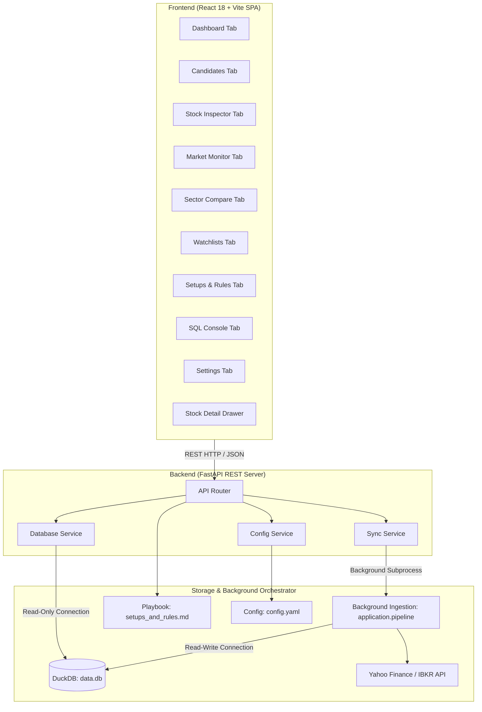

# Web Application Design Document
## PivotTrader Dashboard & Momentum Screener

---

## 1. Executive Summary & Goals

The PivotTrader Web Application serves as an interactive, real-time command center to explore the underlying DuckDB database, configure screening parameters, inspect daily candlestick charts with technical setup overlays, track quarterly earnings acceleration, monitor market regime breadth, and manage custom watchlists and trading playbooks.

---

## 2. System Architecture

The application uses a decoupled client-server architecture built for high performance and clean separation of concerns:



### 2.1 DuckDB Concurrency Strategy
DuckDB enforces a single-writer, multiple-reader locking model:
* **The Challenge:** If the backend web server holds a read-write lock on `data.db`, the background scheduler or CLI script (`application.pipeline`) will fail with a `Database Locked` error.
* **The Solution:** 
  1. The FastAPI web service exclusively instantiates read-only connections (`duckdb.connect(db_path, read_only=True)`), enabling unlimited concurrent HTTP client requests without blocking.
  2. The background ingestion pipeline opens write connections only during batch updates with built-in exponential backoff retry handling (`DatabaseManager.get_connection()`).

---

## 3. Backend API Design (FastAPI)

The backend exposes a comprehensive REST API organized across dedicated service modules.

### 3.1 REST API Endpoint Definition

| Category | HTTP Method | Route | Description |
| :--- | :--- | :--- | :--- |
| **Screener & Candidates** | `GET` | `/api/summary` | Retrieve metadata counts (symbols count, total daily bars, last updated timestamps). |
| | `GET` | `/api/trading-dates` | Retrieve distinct historical trading dates available in `daily_bars`. |
| | `POST` | `/api/candidates` | Server-side filtered candidate scan supporting all setups, sliders, and target dates. |
| | `GET` | `/api/candidates` | Retrieve candidate stocks for a target date (default/unfiltered scan). |
| | `GET` | `/api/stocks/{symbol}` | Retrieve metadata, next earnings date, and Minervini VCP footprint analysis. |
| | `GET` | `/api/stocks/{symbol}/prices` | Retrieve historical daily price bars with moving averages for lightweight-charts. |
| | `GET` | `/api/stocks/{symbol}/financials` | Retrieve yearly and quarterly EPS / revenue statement history. |
| **Market Intelligence** | `GET` | `/api/market-monitor` | Retrieve Stockbee Market Monitor breadth metrics and market regime indicators. |
| | `GET` | `/api/sectors/etfs` | Retrieve Sector ETF performance, RS Rank, and RS Rank Momentum (1W, 1M, 3M). |
| | `GET` | `/api/sectors/{sector_name}/stocks` | Retrieve active candidate stocks belonging to a specific sector/industry group. |
| **Watchlist Management** | `GET` | `/api/watchlists` | Retrieve all custom watchlists with item counts. |
| | `POST` | `/api/watchlists` | Create a new user watchlist. |
| | `DELETE` | `/api/watchlists/{watchlist_id}` | Delete a watchlist. |
| | `GET` | `/api/watchlists/{watchlist_id}/items` | Retrieve all stock symbols contained in a specific watchlist. |
| | `POST` | `/api/watchlists/{watchlist_id}/items` | Add a stock symbol to a watchlist. |
| | `DELETE` | `/api/watchlists/{watchlist_id}/items` | Clear all stock symbols from a watchlist. |
| | `DELETE` | `/api/watchlists/{watchlist_id}/items/{symbol}` | Remove a single symbol from a watchlist. |
| **Playbook & Execution** | `GET` | `/api/setups-and-rules` | Retrieve Markdown content of the Setups & Rules playbook (`setups_and_rules.md`). |
| | `POST` | `/api/setups-and-rules` | Save updated Markdown content to `setups_and_rules.md`. |
| **System & Ingestion** | `GET` | `/api/config` | Retrieve active screening criteria and provider settings from `config.yaml`. |
| | `POST` | `/api/config` | Persist runtime parameter updates to `config.yaml`. |
| | `POST` | `/api/sync/run` | Trigger asynchronous background screening sync with customizable options. |
| | `GET` | `/api/sync/status` | Retrieve live terminal output and status of the background sync process. |
| | `POST` | `/api/sql/query` | Execute read-only SQL queries directly against DuckDB. |

---

## 4. Frontend Interface Design

The frontend is structured as a Single Page Application (SPA) using **React 18** and **Vite**, styled with custom **Glassmorphism CSS** (dark slate theme `#0B0F19`, frosted glass cards `#171D2C/90`, neon accents: green `#10B981`, blue `#3B82F6`, orange `#F59E0B`).

### 4.1 Primary Navigation Tabs

```
+---------------------------------------------------------------------------------------------------------+
|  PivotTrader 📈   [Dashboard] [Candidates] [Inspector] [Market Monitor] [Sectors] [Watchlists] [Rules] |
+---------------------------------------------------------------------------------------------------------+
```

1. **Dashboard Tab (`DashboardTab.jsx`):**
   - **System KPIs:** Total symbols indexed, total daily price bars, last updated timestamps, and active provider.
   - **Sync Control Panel:** Fine-grained synchronization options (Price Data Only, Quarterly Fundamentals, Pre-market Quotes, Historical Lookback Years, Force Full Backfill).
   - **Live Log Terminal:** Real-time log streamer displaying subprocess output during ingestion runs.

2. **Candidates Tab (`CandidatesTab.jsx`):**
   - **Strategy Sidebar:** Interactive filters for Stage 2 Baseline, VCP, Power Play, IPO Base, New Leaders, Qullamaggie Breakout, Episodic Pivot, Parabolic Extension, and 1M/3M/6M Gainers.
   - **Historical Date Picker:** Backtest screening setups on any recorded date in history.
   - **Candidates Table:** Sortable columns with colored status badges, RS ranks, ADR%, and quick watchlist assignment.
   - **TradingView Exporter:** One-click copy/download of screened tickers in TradingView format.

3. **Stock Inspector Tab (`InspectorTab.jsx`):**
   - **Interactive Candlestick Chart:** Lightweight-charts daily candlestick chart with SMA 50 (blue), SMA 150 (orange), SMA 200 (pink), EMA 10/20, and volume bars.
   - **VCP Footprint Card (`VcpFootprintCard.jsx`):** Visualizes contraction waves ($D_1 > D_2 > D_3$), base depths, and tightness metrics.
   - **Fundamental Earnings Tracker:** Historical quarterly and annual financial tables (EPS diluted, QoQ growth %, revenue).

4. **Market Monitor Tab (`MarketMonitorTab.jsx`):**
   - **Stockbee Market Monitor:** Tracks daily market breadth: 4% Gainers/Losers, 25% Monthly/Quarterly Gainers, 50-day / 200-day New Highs/Lows, and Worden T2108 indicators.
   - **Market Posture Gauge:** Classifies market health into *Bullish (Green Light)*, *Neutral (Yellow Light)*, or *Bearish (Red Light)* to dictate portfolio risk allocation.

5. **Sector Compare Tab (`SectorCompareTab.jsx`):**
   - **Sector ETF Heatmap:** Multi-timeframe performance matrix (1D, 1W, 1M, 3M, 6M) across major SPDR sector ETFs.
   - **RS Momentum Tracker:** Visualizes leading vs lagging sector rotation and RS Rank deltas.
   - **Constituent Drill-Down:** Inspects candidate stocks within any chosen industry or sector group.

6. **Watchlists Tab (`WatchlistsTab.jsx`):**
   - **Custom List Management:** Create, rename, and delete custom trading watchlists.
   - **Symbol Management:** Add/remove stock tickers with live price quotes and direct links to Stock Inspector.

7. **Setups & Rules Tab (`SetupsAndRulesTab.jsx`):**
   - **Interactive Playbook:** In-app dual-pane Markdown editor and previewer for `setups_and_rules.md`.
   - **Live Rule Editing:** Edit risk management guidelines, setup checklists, and execution rules directly within the UI.

8. **SQL Console Tab (`SqlConsoleTab.jsx`):**
   - **Query Editor:** Interactive SQL workspace with schema preview, multi-line editor, and query execution against DuckDB.
   - **Safety Enforcement:** Built-in read-only connection ensures data integrity and prevents destructive SQL operations.

9. **Settings Tab (`SettingsTab.jsx`):**
   - **Runtime Config:** Customize default screener thresholds, data provider selections, and export options synced with `config.yaml`.

10. **Stock Detail Drawer (`StockDetailDrawer.jsx`):**
    - **Slide-Out Inspection Modal:** Allows inspecting price charts, technicals, and financials for any stock from any tab without navigating away.

---

## 5. Future Trading Record Ledger

To support subsequent portfolio management capabilities, the database schema accommodates transactional tracking:

```sql
CREATE TABLE IF NOT EXISTS trading_records (
    trade_id VARCHAR PRIMARY KEY,
    symbol VARCHAR NOT NULL,
    direction VARCHAR CHECK (direction IN ('BUY', 'SELL')),
    date DATE NOT NULL,
    shares INTEGER NOT NULL,
    price DOUBLE NOT NULL,
    commission DOUBLE DEFAULT 0.0,
    notes VARCHAR
);

CREATE OR REPLACE VIEW active_portfolio AS
WITH trade_sums AS (
    SELECT 
        symbol,
        SUM(CASE WHEN direction = 'BUY' THEN shares ELSE -shares END) as net_shares,
        SUM(CASE WHEN direction = 'BUY' THEN shares * price ELSE 0 END) as buy_value,
        SUM(CASE WHEN direction = 'BUY' THEN shares ELSE 0 END) as buy_shares
    FROM trading_records
    GROUP BY symbol
)
SELECT 
    symbol,
    net_shares as position_size,
    (buy_value / NULLIF(buy_shares, 0)) as average_cost
FROM trade_sums
WHERE net_shares > 0;
```

